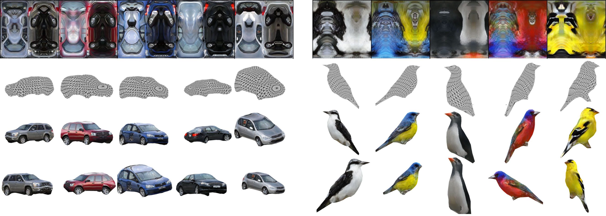
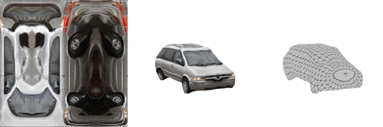
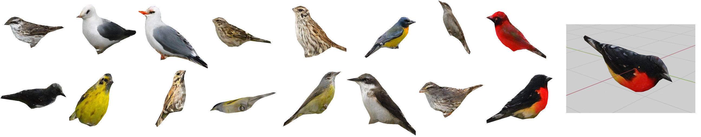

# Convolutional Generation of Textured 3D Meshes

This is the reference implementation of "Convolutional Generation of Textured 3D Meshes", accepted at **NeurIPS 2020** with oral presentation.

> Dario Pavllo, Graham Spinks, Thomas Hofmann, Marie-Francine Moens, and Aurelien Lucchi. [Convolutional Generation of Textured 3D Meshes](https://arxiv.org/abs/2006.07660). In Neural Information Processing Systems (NeurIPS), 2020.

The paper proposes a novel GAN framework for generating 3D triangle meshes and corresponding texture maps, leveraging recent advances in differentiable rendering. The model can be conditioned on a variety of inputs, including class labels, attributes, and text via an attention mechanism.




## Setup
Instructions on how to set up dependencies, datasets, and pretrained models can be found in [SETUP.md](SETUP.md)

## Evaluating pretrained models
In order to test our pretrained models, the minimal setup described in [SETUP.md](SETUP.md) is sufficient. No dataset setup is required.
We provide an interface for evaluating FID scores, as well as an interface for exporting a sample of generated 3D meshes (both as a grid of renderings and as .obj meshes).

### Exporting a sample
You can export a sample of generated meshes using `--export-sample`. For a quick demo on CUB, run:
```
python run_generation.py --name pretrained_cub_512x512_class --conditional_class --dataset cub --gpu_ids 0 --batch_size 16 --export_sample
```
This will generate a sample of 16 meshes, render them from random viewpoints, and export the final result to the `output` directory as a png image. In addition, the script will export the meshes as .obj files (along with material and texture). These can be imported into Blender or other modeling tools.



### Evaluating FID scores on pretrained models
For CUB, we provide pretrained models where the generator is conditioned on class labels, captions, or nothing. You can evaluate them as follows:
```
python run_generation.py --name pretrained_cub_512x512_class --conditional_class --dataset cub --gpu_ids 0,1,2,3 --batch_size 64 --evaluate
python run_generation.py --name pretrained_cub_512x512_text --conditional_text --dataset cub --gpu_ids 0,1,2,3 --batch_size 64 --evaluate
python run_generation.py --name pretrained_cub_512x512_uncond --dataset cub --gpu_ids 0,1,2,3 --batch_size 64 --evaluate
```

For Pascal3D+, the pretrained models are conditioned on either class labels, class+color, or nothing.
```
python run_generation.py --name pretrained_p3d_512x512_class --conditional_class --dataset p3d --gpu_ids 0,1,2,3 --batch_size 64 --evaluate
python run_generation.py --name pretrained_p3d_512x512_class_color --conditional_class --conditional_color --dataset p3d --gpu_ids 0,1,2,3 --batch_size 64 --evaluate
python run_generation.py --name pretrained_p3d_512x512_uncond --dataset p3d --gpu_ids 0,1,2,3 --batch_size 64 --evaluate
```
You can of course adjust the number of GPUs and batch size to suit your computational resources. For evaluation, 16 elements per GPU is a sensible choice. You can also tune the number of data-loading threads using the `--num_workers` argument (default: 4 threads). If unspecified, the truncation sigma for evaluation is autodetected depending on the dataset. In case you want to specify it manually, you can do so through the `--truncation_sigma` argument (e.g. to disable truncation, specify a large value like 1000).

The table below summarizes the FID scores you can expect when evaluating the pretrained models:
| Dataset | Split | Texture resolution | Conditioning |  FID (Full) | $$\sigma$$ |
|:-------|:-------:|:-------:|:-------:|:-------:|:-------:|
| CUB Birds | testval  | 512 x 512 | Class | ~33 | 0.25 |
| CUB Birds | testval  | 512 x 512 | Text | ~18 | 0.5 |
| CUB Birds | testval  | 512 x 512 | None | ~41 | 1.0 |
| Pascal3D+ Cars | train  | 512 x 512 | Class  | ~27 | 0.75 |
| Pascal3D+ Cars | train  | 512 x 512 | Class+Color | ~31 | 0.5 |
| Pascal3D+ Cars | train  | 512 x 512 | None  | ~43 | 1.0 |


To evaluate the Mesh FID and Texture FID (described in the paper), you need to set up the pseudo-ground-truth data as described in the next section.

## Generating pseudo-ground-truth data
This steps requires a trained mesh estimation model. You can use the pretrained one we provide or train it from scratch (as described in the next section).
The pseudo-ground-truth for CUB can be generated as follows:
```
python run_reconstruction.py --name pretrained_reconstruction_cub --dataset cub --batch_size 10 --generate_pseudogt
```
The command for Pascal3D+ is:
```
python run_reconstruction.py --name pretrained_reconstruction_p3d --dataset p3d --optimize_z0 --batch_size 10 --generate_pseudogt
```

This will create (or replace) a directory `cache`, which contains precomputed statistics for FID evaluation, pose/image metadata, and the pseudo-ground-truth for each image.


## GAN training
To train the mesh generator from scratch, you first need to set up the pseudo-ground-truth data as described in the section above. Then, you can train a new model as follows:
```
python run_generation.py --name cub_512x512_class --conditional_class --dataset cub --gpu_ids 0,1,2,3 --batch_size 32 --epochs 600 --tensorboard
```
This command will train a CUB model conditioned on class labels, for 600 epochs. By default, FID evaluations are carried out every 20 epochs, but you can change this value using the flag `--evaluate_freq`. If you specify `--tensorboard`, training curves, FID curves, and generated results will be exported in the Tensorboard log directory `tensorboard_gan`. Note that using a different batch size or number of GPUs might results in slightly different results than those reported in the paper.

Once the training process has finished, you can find the best checkpoint (in terms of FID score) by running:
```
python run_generation.py --name cub_512x512_class --conditional_class --dataset cub --gpu_ids 0,1,2,3 --batch_size 64 --evaluate --which_epoch best
```

For Pascal3D+ and the other settings, the commands to train new models are the same as the evaluation ones, but without the `--evaluate` flag (and with a batch size of 32).

## Mesh estimation model training
To train the mesh estimation model from scratch (the very first step of the pipeline), you can use the following two commands:
```
python run_reconstruction.py --name pretrained_reconstruction_cub --dataset cub --batch_size 50 --tensorboard
python run_reconstruction.py --name pretrained_reconstruction_p3d --dataset p3d --optimize_z0 --batch_size 50 --tensorboard
```
Tensorboard logs are saved in `tensorboard_recon`.

## Citation
If you use this work in your research, please consider citing our paper:
```
@inproceedings{pavllo2020convmesh,
  title={Convolutional Generation of Textured 3D Meshes},
  author={Pavllo, Dario and Spinks, Graham and Hofmann, Thomas and Moens, Marie-Francine and Lucchi, Aurelien},
  booktitle={Neural Information Processing Systems (NeurIPS)},
  year={2020}
}
```

## License and Acknowledgments
Our work is licensed under the MIT license. For more details, see [LICENSE](LICENSE).
This repository includes third-party libraries which may be subject to their respective licenses: [Synchronized-BatchNorm-PyTorch](https://github.com/vacancy/Synchronized-BatchNorm-PyTorch), the data loader from [CMR](https://github.com/akanazawa/cmr), some text processing scripts from [AttnGAN](https://github.com/taoxugit/AttnGAN), and FID evaluation code from [pytorch-fid](https://github.com/mseitzer/pytorch-fid).